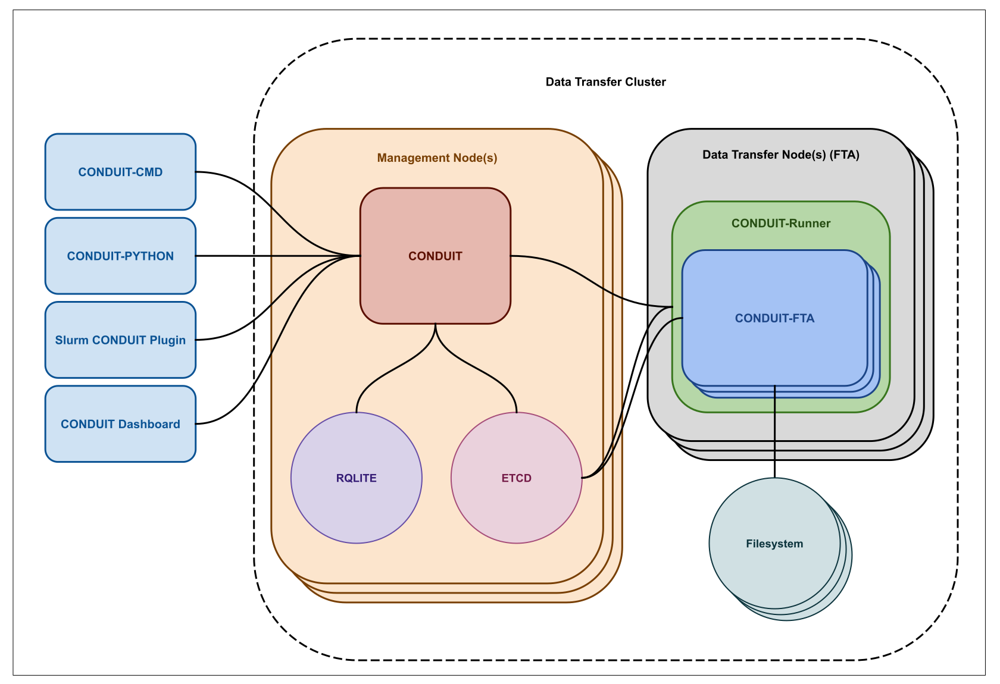
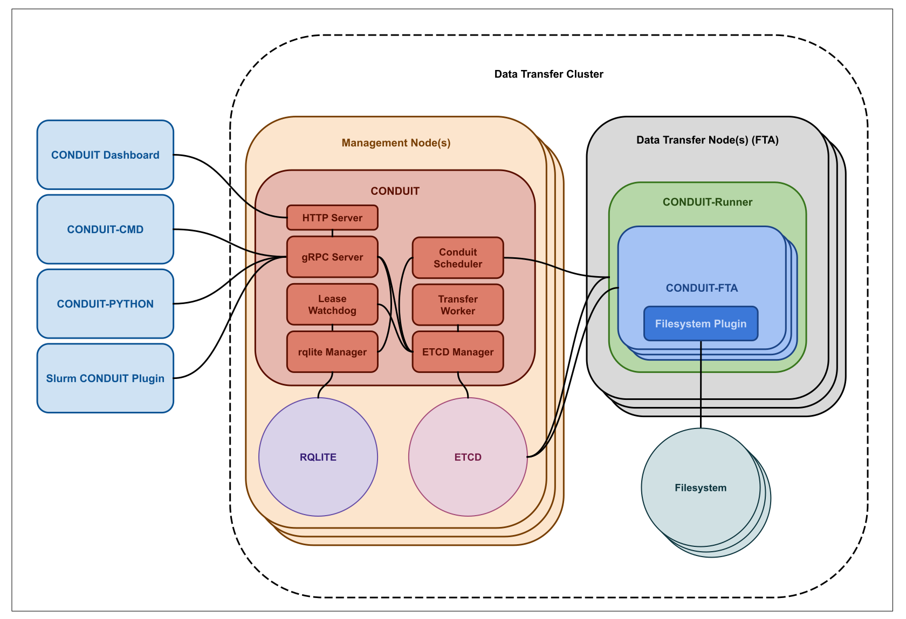

# Architecture

This document describes the internal architecture of Conduit and the responsibilities of its major components.

## High-Level System Layout

## Control Plane Components

### Conduit Server

The Conduit server is composed of the following internal components:

- **HTTP Server** – Currently Disabled
- **gRPC Server** – Handles user-facing API requests
- **Scheduler** – Determines transfer execution order and resource allocation
- **Transfer Workers** – Track and manage active transfers
- **Lease Watchdog** – Monitors liveness and detects failed components
- **etcd Manager** – Handles coordination and shared state
- **rqlite Manager** – Persists finalized transfer records

## Data Transfer Execution

### Runner and FTA Responsibilities
...
