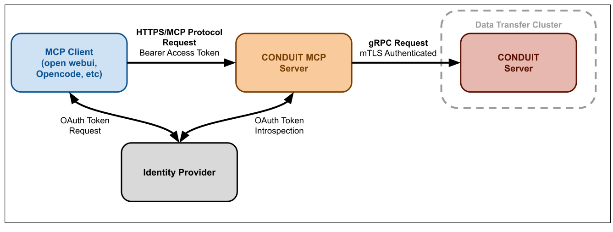

# Conduit MCP Server Operations Guide

This guide covers deploying and operating the Conduit MCP (Model Context Protocol) server, which exposes Conduit's file transfer capabilities through the MCP protocol.

## Example MCP Server Layout




## Configuration

### Example Configuration File

See [full reference config](../configs/conduit-mcp-full-reference-config.yaml) for more details

```yaml
# Connection to Conduit server
conduit:
  ip: conduit-server.example.com
  port: 23456
  ca: /path/to/conduit-ca.pem
  request-timeout: 30s

# MCP server settings
server:
  ip: 0.0.0.0
  port: 8081
  public-url: "https://mcp.example.com"
  metadata-path: /.well-known/oauth-protected-resource
  http:
    allowed-origins:
      - "https://client1.example.com"
      - "https://client2.example.com"

# OAuth authentication
oauth:
  discovery-url: "https://auth.example.com/.well-known/openid-configuration"
  ca: /path/to/oauth-ca.pem
  username-claims:
    - preferred_username
    - email
  # Optional: introspection-auth-method: client_secret_basic

# Client configuration for connecting the mcp server to Conduit
client:
  cert: /path/to/client-cert.pem
  key: /path/to/client-key.pem

# Optional: enable debug logging
debug: true
```

### Environment Variables

The MCP server also supports configuration via environment variables:

```bash
# OAuth Configuration
CONDUIT_MCP_OAUTH_ISSUER=https://auth.example.com
CONDUIT_MCP_OAUTH_CLIENT_ID=your-client-id
CONDUIT_MCP_OAUTH_CLIENT_SECRET=your-client-secret
CONDUIT_MCP_OAUTH_INTROSPECTION_URL=https://auth.example.com/oauth/v2/introspect
CONDUIT_MCP_OAUTH_USERINFO_URL=https://auth.example.com/oidc/v1/userinfo

# Server Configuration
CONDUIT_MCP_SERVER_PUBLIC_URL=https://mcp.example.com
```

Environment variables take precedence over configuration file values for OAuth settings.

## Implementation Options

### Prerequisites

- Conduit server running and accessible
- OAuth/OIDC identity provider configured
- mTLS certificates for connecting the MCP server to Conduit (see [cert generation for details](cert-generation.md))

### Command Line

```bash
# Using configuration file
conduit-mcp --config /path/to/config.yaml

# With debug logging
conduit-mcp --config /path/to/config.yaml --debug
```

### Systemd Service

example systemd unit file:

```ini
[Unit]
Description=Conduit MCP Server
Documentation=https://github.com/lanl/conduit
After=network-online.target local-fs.target remote-fs.target time-sync.target
Wants=network-online.target local-fs.target remote-fs.target time-sync.target

[Service]
Type=simple
ExecStart=/usr/local/bin/conduit-mcp --config /etc/conduit/conduit-mcp-config.yaml
Restart=on-failure
RestartSec=5s
KillMode=mixed
KillSignal=SIGTERM
TimeoutStopSec=5h
SendSIGKILL=yes

[Install]
WantedBy=multi-user.target

```

Enable and start the service:

```bash
sudo systemctl daemon-reload
sudo systemctl enable conduit-mcp
sudo systemctl start conduit-mcp
sudo systemctl status conduit-mcp
```

### Docker

#### Build and Run

```bash
# Build the image
docker build -f docker/Dockerfile.mcp -t conduit-mcp:latest .

# Run the container
docker run -d \
  --name conduit-mcp \
  -p 8081:8081 \
  -v /path/to/config.yaml:/etc/conduit/conduit-mcp-config.yaml:ro \
  -v /path/to/certs:/etc/conduit/keys:ro \
  conduit-mcp:latest
```
